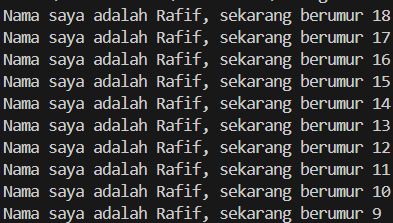
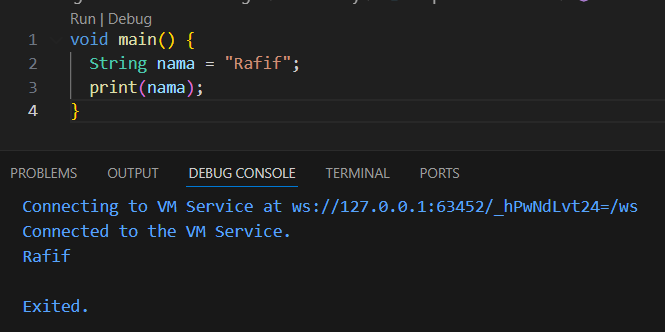
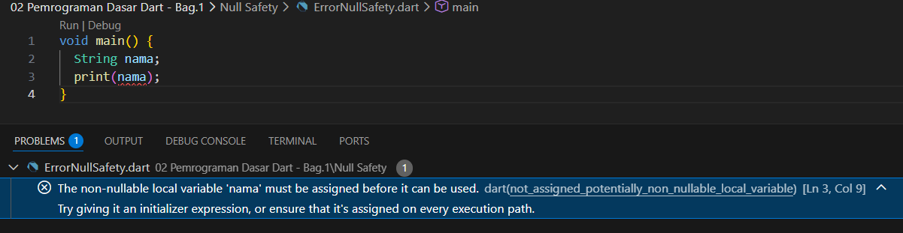
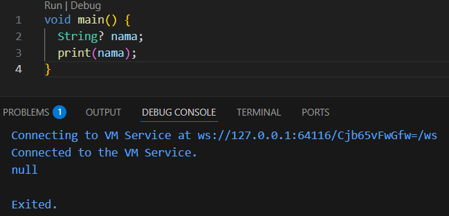
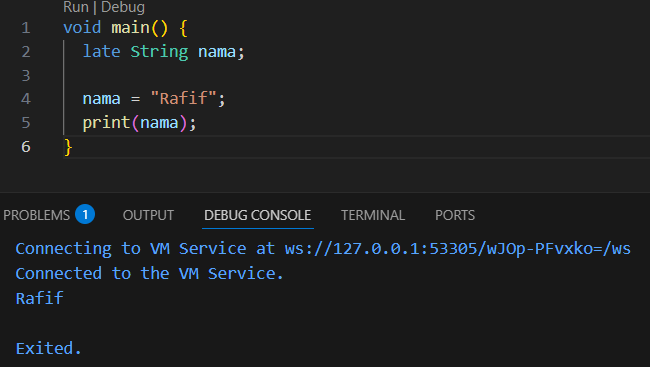
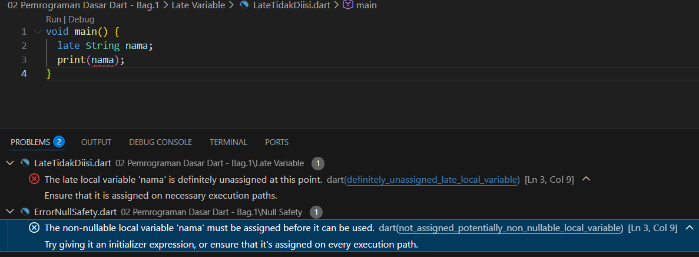

# Laporan Praktikum #02 Pemrograman Dasar Dart - Bag.1

## Identitas Mahasiswa

| Atribut | Nilai                        |
| ------- | -----                        |
| Nama    | Rafif Farrelsyah Fawwazka    |
| NIM     | 244107060054                 |
| Kelas   | SIB-2D                       |

---

## Tugas Praktikum 2

## Soal 1

Modifikasilah kode pada baris 3 di VS Code atau Editor Code favorit Anda berikut ini agar mendapatkan keluaran (output) sesuai yang diminta!

Jawaban:
Kode Program :

Hasil Run :

## Soal 2

Mengapa sangat penting untuk memahami bahasa pemrograman Dart sebelum kita menggunakan framework Flutter ? Jelaskan!

Jawaban:
Memahami bahasa pemrograman dart sangat penting sebelum menggunakan framework flutter karena seluruh proses pembuatan aplikasi flutter, mulai dari logika program, tampilan antarmuka, hingga pengelolaan data dan state, dibangun menggunakan Dart

## Soal 3

Rangkumlah materi dari codelab ini menjadi poin-poin penting yang dapat Anda gunakan untuk membantu proses pengembangan aplikasi mobile menggunakan framework Flutter.

Jawaban:
- Dart adalah bahasa utama pada Flutter.
- Dart menggunakan konsep OOP.
- Mendukung JIT untuk development dan Hot Reload.
- Menggunakan AOT untuk performa aplikasi saat rilis.
- Program dimulai dari fungsi main().
- Memiliki tipe data dasar seperti int, String, dan bool.
- Operator digunakan untuk pengolahan data.
- Class dan object digunakan untuk membuat widget.
- Debugging digunakan untuk memperbaiki error.
- Pemahaman Dart memudahkan pengembangan aplikasi Flutter.

## Soal 4

Buatlah penjelasan dan contoh eksekusi kode tentang perbedaan Null Safety dan Late variabel !

Jawaban:

### NULL SAFETY

Null Safety adalah fitur Dart yang mencegah variabel memiliki nilai null kecuali diizinkan secara eksplisit. Tujuannya untuk menghindari error null reference saat program berjalan.

## Contoh Tanpa Null Safety

Variable nama tidak boleh kosong (null)

## Contoh Error Null Safety

Error karena variable wajib memiliki nilai awal

## Mengizinkan Null
Gunakan tanda ?

Artinya variable boleh bernilai null

### LATE VARIABLE

Late variable digunakan ketika variabel akan diinisialisasi nanti, tetapi dijamin memiliki nilai sebelum digunakan.
Keyword: late

## Contoh Late Variable

Variable dideklarasikan dulu, nilainya diberikan nantinya

## Jika Late Tidak Diisi

Error karena variabel belum diberi nilai

### KESIMPULAN

Null Safety digunakan untuk mengontrol kemungkinan nilai null, sedangkan late variable digunakan ketika variabel belum diisi saat deklarasi tetapi akan diberikan nilai sebelum digunakan dalam program Dart.