# Laporan Praktikum #02 Pemrograman Dasar Dart - Bag.2

## Identitas Mahasiswa

| Atribut | Nilai                        |
| ------- | -----                        |
| Nama    | Rafif Farrelsyah Fawwazka    |
| NIM     | 244107060054                 |
| Kelas   | SIB-2D                       |

---

# Nomor 1

## Praktikum 1

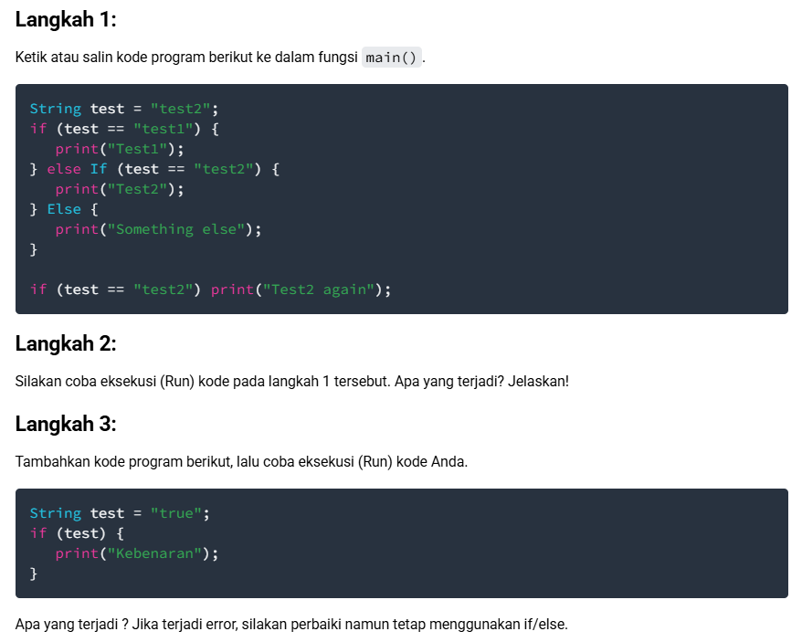

Langkah 1&2:

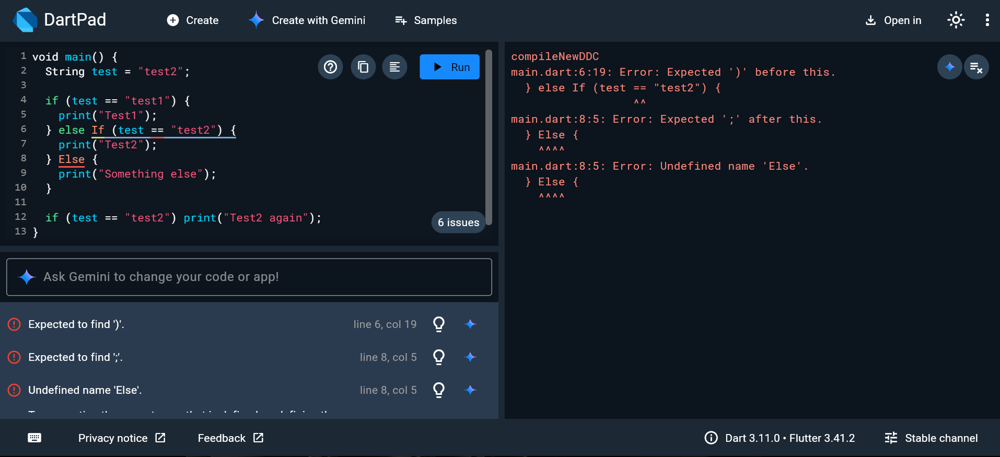

Error dikarenakan else dan if nya ada yang memakai huruf besar, sedangkan penulisan else dan if harus menggunakan huruf kecil

Perbaikan:
 
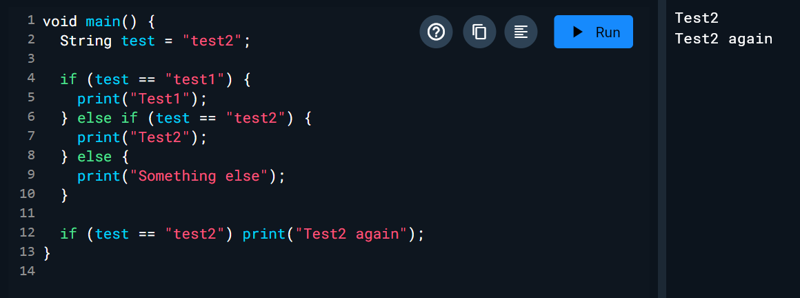

Langkah 3:

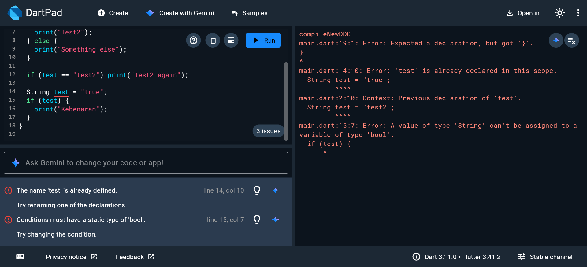

Error karena Dart mewajibkan kondisi di dalam kurung tersebut menghasilkan nilai Boolean (true/false)

Perbaikan:

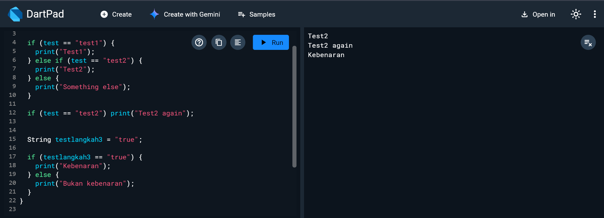

## Praktikum 2

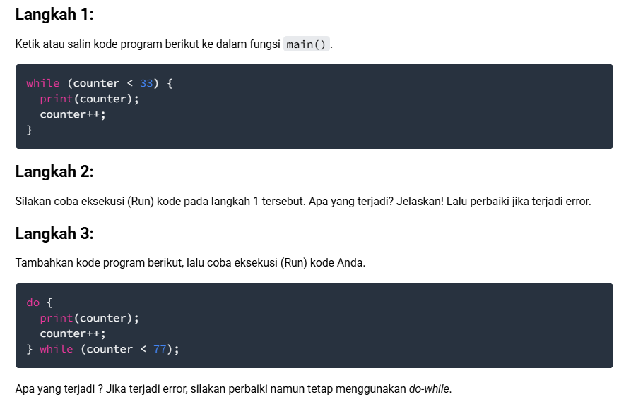

Langkah 1&2:

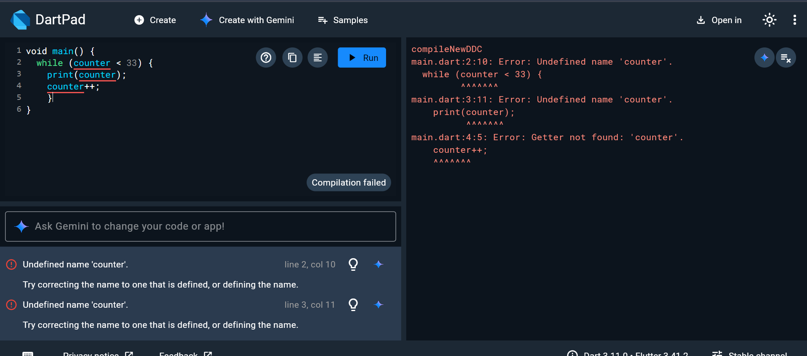

Error, karena counter belum dideklarasikan

Perbaikan:

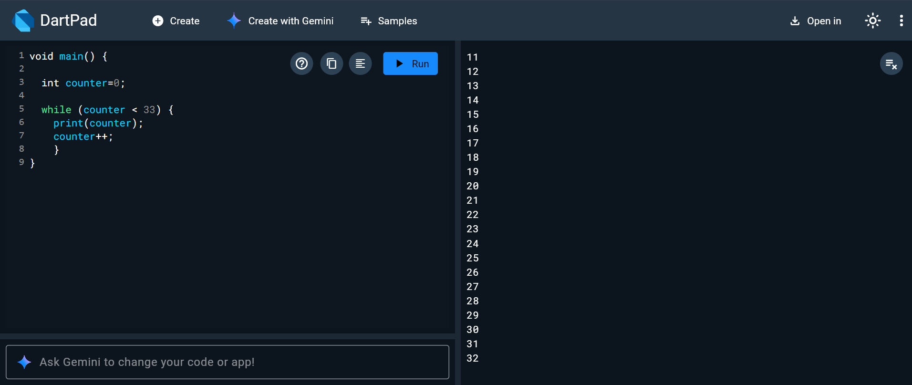

Langkah 3:

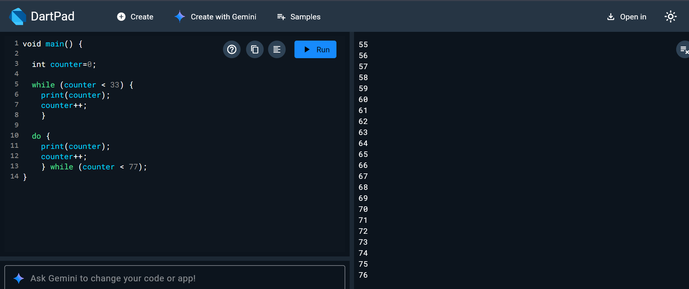

Program akan mencetak angka dari 0 sampai 32 (dari perulangan while), lalu langsung berlanjut mencetak angka 33 sampai 76 (dari perulangan do-while)
- Program masuk ke blok do. Karena variabel counter sudah ada dan bernilai 33, program tidak error
- Program langsung mencetak nilai counter saat itu, yaitu 33, lalu menambahnya menjadi 34
- Kondisi while (counter < 77) diperiksa. Karena 34 < 77 adalah benar, perulangan berlanjut

## Praktikum 3

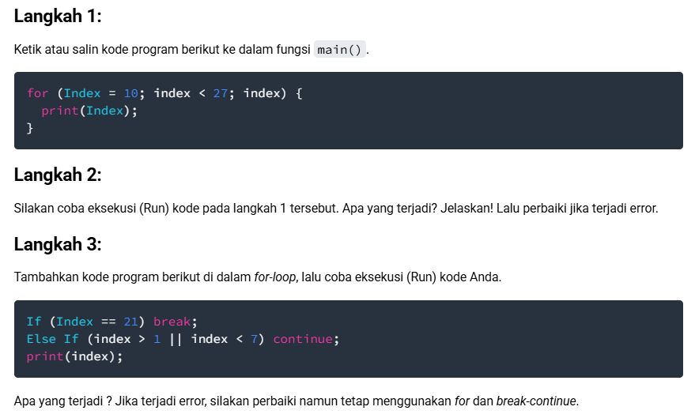

Langkah 1&2:

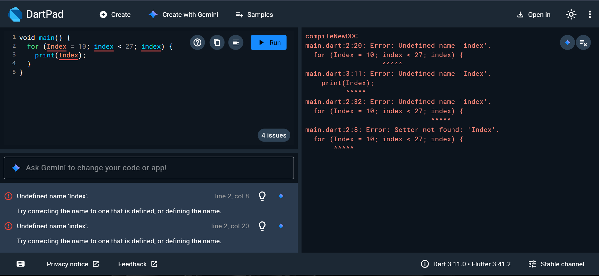

Error karena:
1. Index seharusnya I nya huruf kecil
2. Variabel index belum diberi tipe data
3. Bagian ketiga pada loop index tidak melakukan operasi apapun, seharusnya seperti index++

Perbaikan:

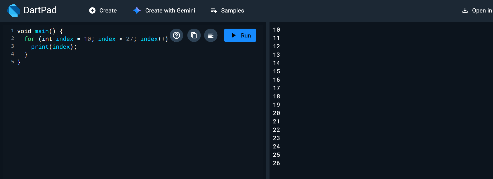

Langkah 3:

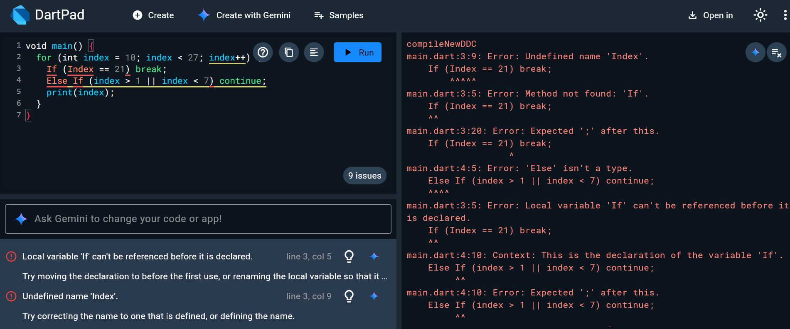

Error karena:
1. if dan else if harus ditulis dengan huruf kecil semua (if, else if)
2. Index seharusnya I nya huruf kecil
3. Kondisi else if (index > 1 || index < 7) akan selalu bernilai true untuk angka 10 hingga 21. Akibatnya, perintah print(index) di bawahnya tidak akan pernah dieksekusi karena continue langsung melompat ke iterasi berikutnya

Perbaikan:

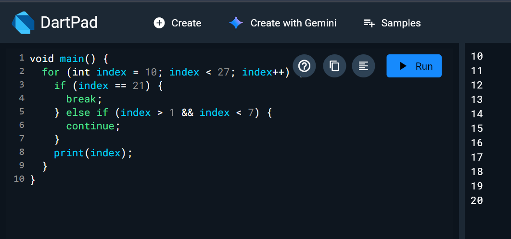

# Nomor 2

## Tugas

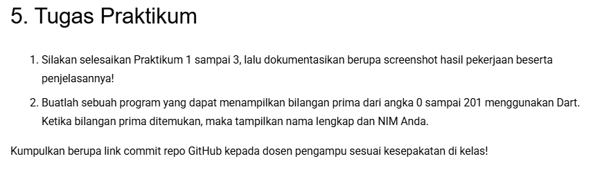

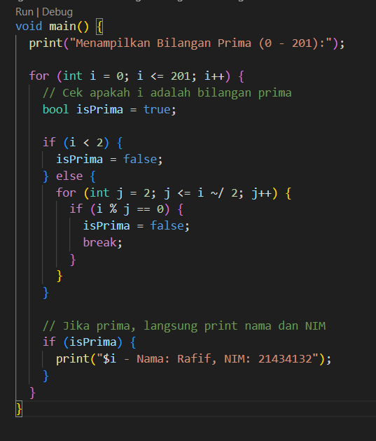

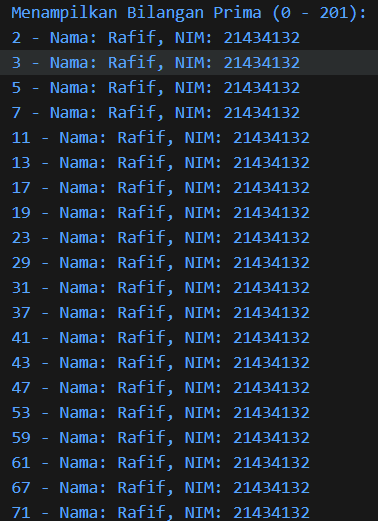

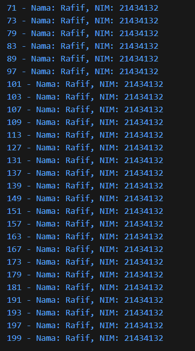

