# Laporan Praktikum #04 Pemrograman Dasar Dart - Bag.3

## Identitas Mahasiswa

| Atribut | Nilai                        |
| ------- | -----                        |
| Nama    | Rafif Farrelsyah Fawwazka    |
| NIM     | 244107060054                 |
| Kelas   | SIB-2D                       |

---

# Tugas Praktikum

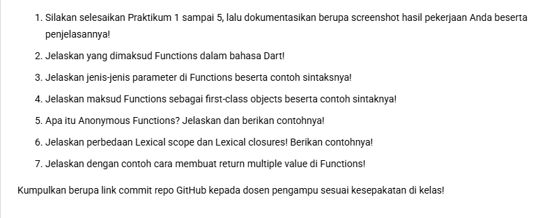

# Nomor 1

## Praktikum 1 : Eksperimen Tipe Data List

Langkah 1&2:

List di Dart memiliki indeks yang dimulai dari nol dan nilainya dapat diubah setelah dideklarasikan. Penggunaan assert sangat efektif untuk memastikan data tetap konsisten selama alur program berjalan, meskipun tidak akan memengaruhi output akhir jika semua kondisi bernilai benar (True)

Langkah 3:

- final list: Menggunakan keyword final berarti variabel list tidak dapat dideklarasikan ulang (di-assign) ke objek list yang baru, namun isi di dalamnya masih bisa diubah.
- List.filled(6, null): Untuk memiliki index ke-5, list harus memiliki total 6 elemen (karena indeks dimulai dari 0). Kita mengisi nilai awal dengan null.
- <dynamic>: Digunakan agar list dapat menampung tipe data yang berbeda (String untuk nama dan null untuk default).
- Pengisian Data: Menggunakan list[1] untuk menyimpan Nama dan list[2] untuk menyimpan NIM 

## Praktikum 2 : Eksperimen Tipe Data Set

Langkah 1&2:

- Tipe Data Set: Penggunaan kurung kurawal {} pada variabel halogens menandakan bahwa ini adalah sebuah Set. Dalam Dart, Set<String> adalah kumpulan item unik yang tidak terurut.
- Inference Tipe: Karena menggunakan kata kunci var, Dart secara otomatis mendeteksi bahwa halogens adalah Set<String>.
- Fungsi print(): Baris kedua akan mencetak seluruh isi dari set tersebut dalam format standar objek Set.

Langkah 3:

tidak erorr, namun pada names 3 meskipun menggunakan kurung kurawal {}, Dart secara default menganggap {} tanpa isi dan tanpa deklarasi tipe sebagai Map kosong, bukan Set. Konsol tetap mencetak {}, tapi tipenya adalah Map<dynamic, dynamic>. Dan ini adalah perbaikannya:

- {} tanpa keterangan = Map (Kumpulan pasangan key:value).
- <String>{} atau Set{} = Set (Kumpulan nilai unik).

Nama dan NIM menggunakan add dan addall

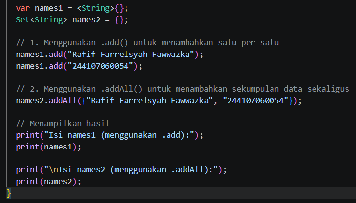

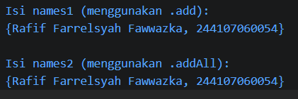

## Praktikum 3 : Eksperimen Tipe Data Maps

Langkah 1&2:

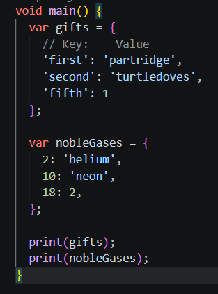

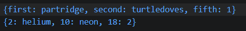

Program tidak erorr
- Kode ini menggunakan tipe data Map.
- Map adalah koleksi objek yang menyimpan data dalam pasangan Key (kunci) dan Value (nilai).
- Pada variabel gifts, kuncinya adalah String (seperti 'first') dan nilainya bisa berupa String maupun Int.
- Pada variabel nobleGases, kuncinya adalah Int (nomor atom) dan nilainya adalah nama gas tersebut atau angka.

Langkah 3:

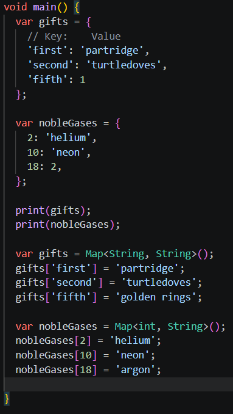

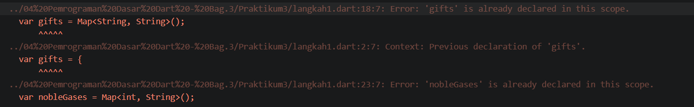

Program Erorr
- Masalah 1: Ada variabel baru bernama mhs1 dan mhs2, tetapi baris di bawahnya mencoba mengisi data ke variabel gifts dan nobleGases. Jika variabel gifts dan nobleGases belum dideklarasikan sebelumnya maka akan erorr
- Masalah 2: Jika ingin mengisi mhs1 dan mhs2 maka variabel yang digunakan untuk mengisi data haruslah mhs1[...] dan mhs2[...].

Perbaikan:

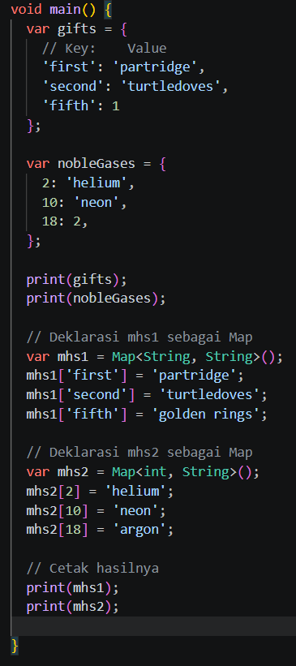

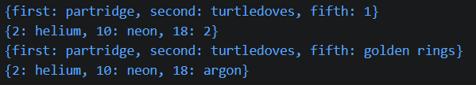

Tambah Nama dan NIM:

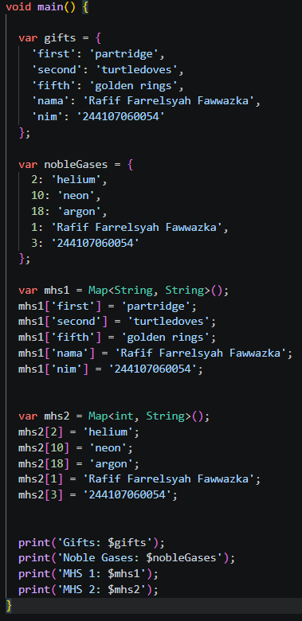

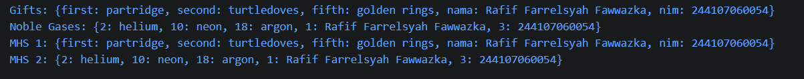

## Praktikum 4 : Eksperimen Tipe Data List: Spread dan Control-flow Operators

Langkah 1&2:

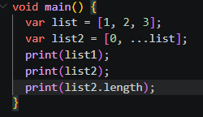

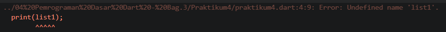

Program Erorr
- Tertulis: print(list1);
- Sedangkan variabel yang didefinisikan sebelumnya adalah list

Perbaikan:

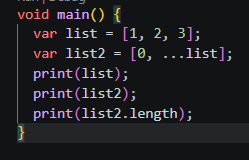

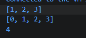

Langkah 3:

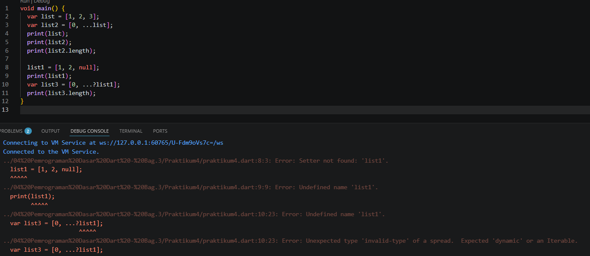

Program Erorr
Variabel list1 tidak dideklarasikan: perlu menambahkan kata kunci var, final, atau tipe data List sebelum nama variabel.

Perbaikan:

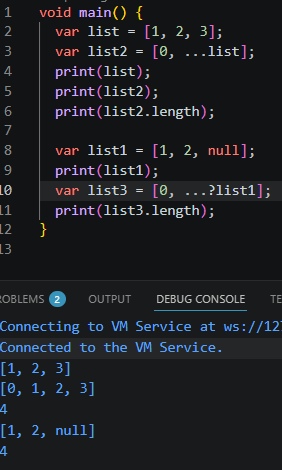

Menambah NIM menggunakan Spread Operators:

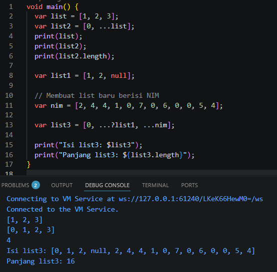

Langkah 4:

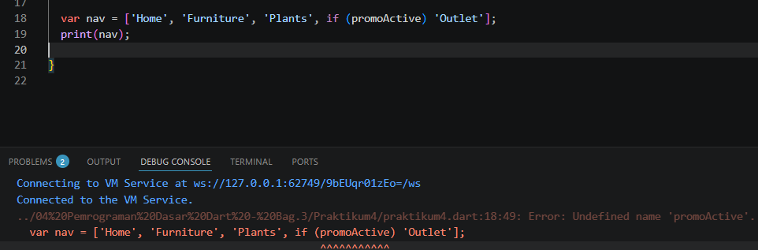

Program Erorr
Masalahnya adalah variabel promoActive belum didefinisikan

Perbaikan:

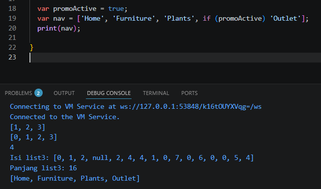

Jika variabel promoActive false:
Outlet tidak diprint

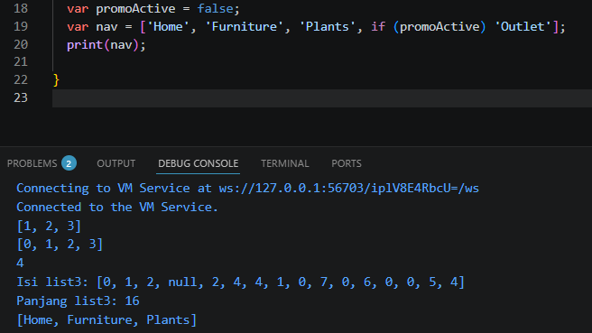

Langkah 5:

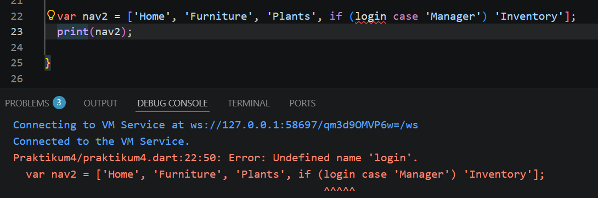

Program Erorr
Masalahnya adalah variabel login belum didefinisikan

Perbaikan:

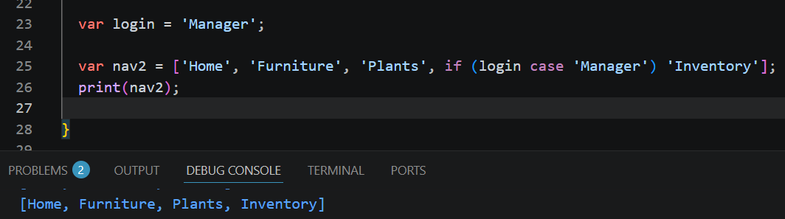

Jika variabel promoActive false:
Inventory tidak di print

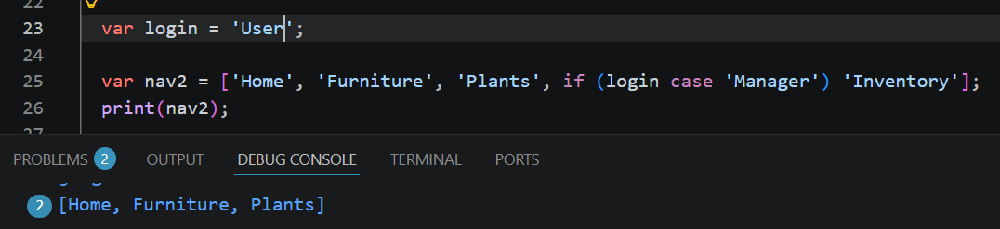

Langkah 6:

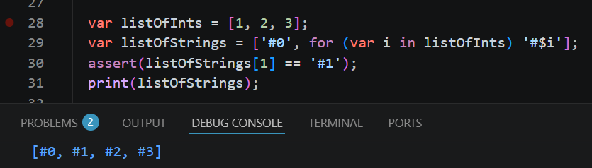

Program Tidak erorr
kode tersebut menggunakan Collection For

Manfaat Collection For :
1. Kode Lebih Ringkas
Tanpa Collection For, kamu harus membuat list kosong terlebih dahulu, lalu menggunakan fungsi .add() atau .addAll() di baris terpisah. Dengan fitur ini, semua dilakukan dalam satu blok deklarasi.

2. Deklarasi Bersifat Deklaratif
Kamu mendefinisikan apa yang harus ada di dalam list saat list itu dibuat, bukan memberikan instruksi langkah-demi-langkah (imperatif) setelah list dibuat. Ini membuat kode lebih mudah dibaca.

3. Mempermudah Manipulasi Data
Sangat berguna untuk mengubah (transformasi) satu list ke list lain dengan format yang berbeda (misalnya dari angka ke string atau dari objek data ke widget UI di Flutter).

Dokumentasi Hasil:
Proses Eksekusi (Step-by-Step):
Inisialisasi: List dimulai dengan elemen pertama yaitu '#0'
Iterasi 1: i bernilai 1. Ditambahkan string '#1'
Iterasi 2: i bernilai 2. Ditambahkan string '#2'
Iterasi 3: i bernilai 3. Ditambahkan string '#3'
Finalisasi: List ditutup dan disimpan ke variabel listOfStrings

## Praktikum 5 : Eksperimen Tipe Data Records

Langkah 1:

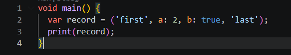

Langkah 2:

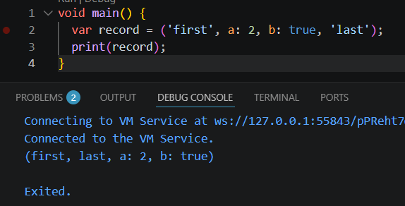

Program Tidak Erorr
'first' dan 'last' merupakan positional field.
a: 2 dan b: true merupakan named field.

Langkah 3:

Program Tidak Erorr

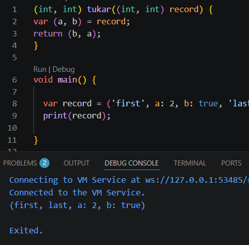

dan berfungsi untuk menukar posisi nilai pada record.

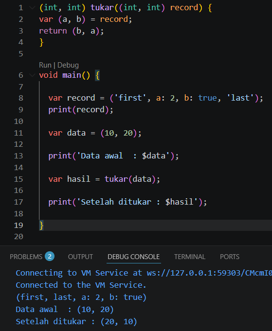

Langkah 4:

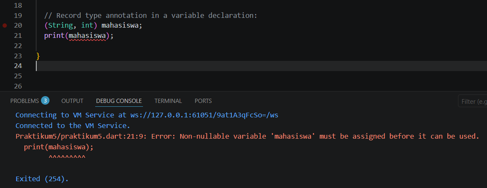

Program Erorr
karena variabel mahasiswa baru dideklarasikan tetapi belum diberi nilai (belum diinisialisasi), namun langsung dipanggil dengan print(mahasiswa);

Perbaikan:

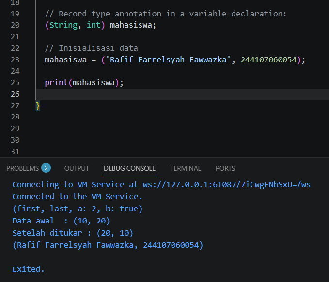

Langkah 5:

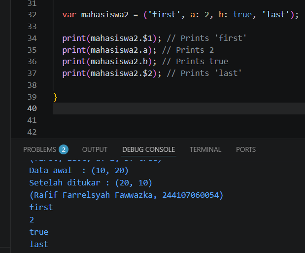

Program Tidak Erorr

Mengganti salah satu isi record dengan nama dan NIM

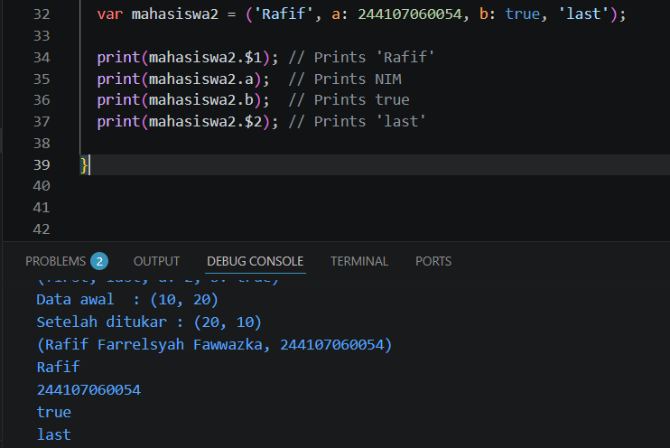

# Nomor 2

Function dalam bahasa Dart adalah blok kode yang digunakan untuk menjalankan tugas tertentu. Function membantu program menjadi lebih rapi, mudah digunakan kembali, dan mengurangi penulisan kode berulang.

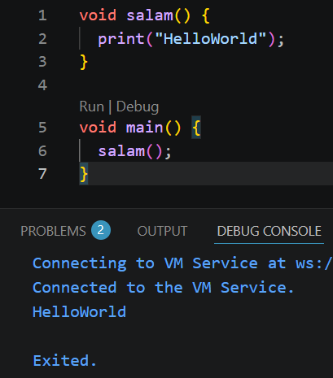

# Nomor 3

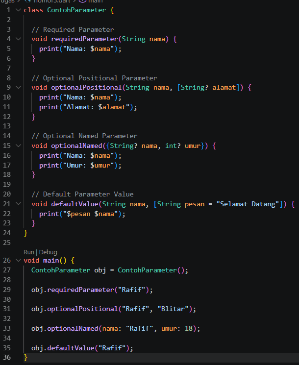

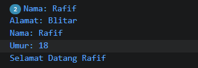

Required Parameter : Parameter wajib diisi saat function dipanggil.
Optional Positional Parameter : Parameter opsional yang ditulis di dalam tanda [].
Optional Named Parameter : Parameter opsional dengan nama tertentu menggunakan {}.
Default Parameter Value : Parameter memiliki nilai bawaan.

# Nomor 4

Dalam Dart, function dianggap sebagai first-class objects, artinya function dapat disimpan ke variabel, dikirim sebagai parameter, dan dikembalikan dari function lain.

Contoh Sintaks :

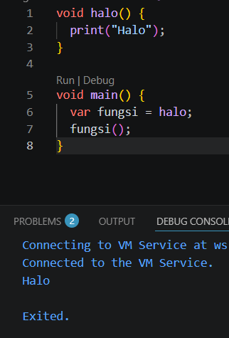

Contoh function sebagai parameter:

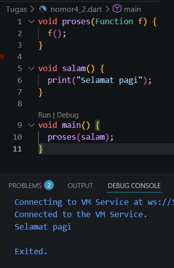

# Nomor 5

Anonymous Function adalah function tanpa nama yang biasanya digunakan langsung pada suatu operasi atau disimpan ke variabel.

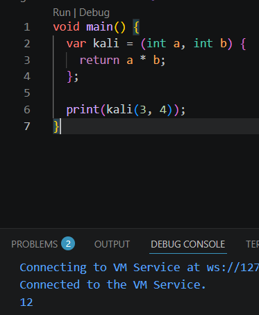

# Nomor 6

a.Lexical Scope

Lexical scope adalah aturan bahwa variabel hanya bisa diakses pada lingkup tempat variabel tersebut dibuat.

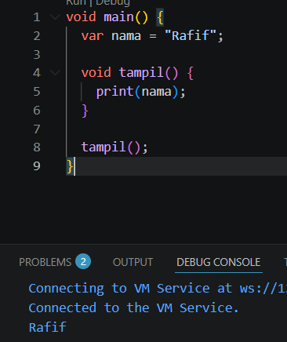

b.Lexical Closure

Closure adalah function yang masih dapat mengakses variabel dari scope luar meskipun scope tersebut sudah selesai dijalankan.

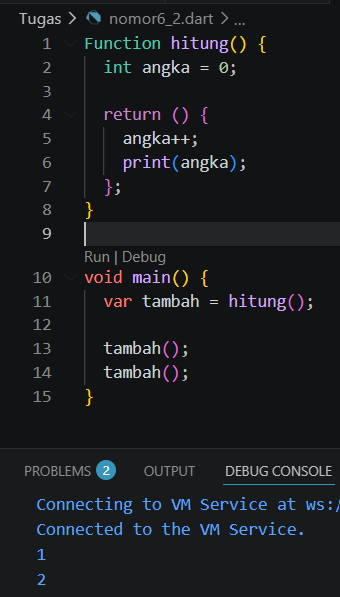

Dart tidak bisa langsung mengembalikan banyak nilai sekaligus, tetapi bisa menggunakan List, Map, atau Record.

a. Menggunakan List

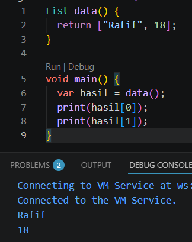

b. Menggunakan Map

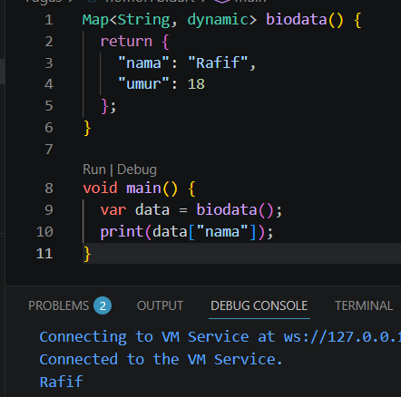

c. Menggunakan Record

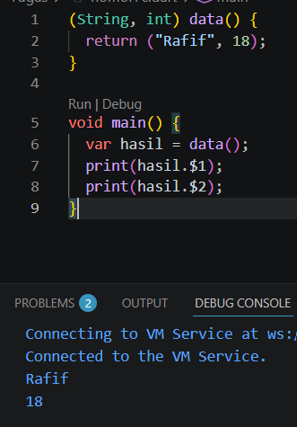

