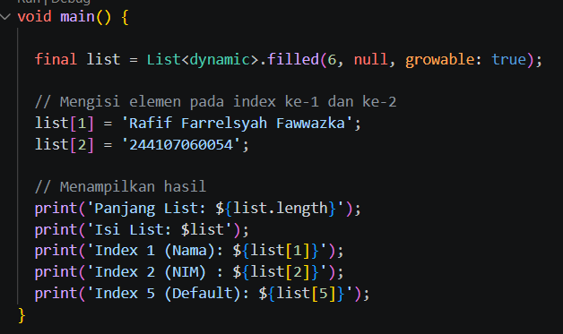
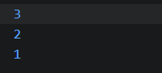
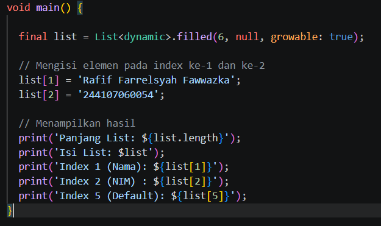
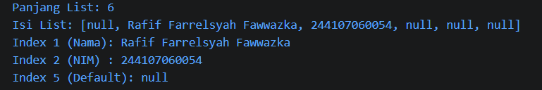
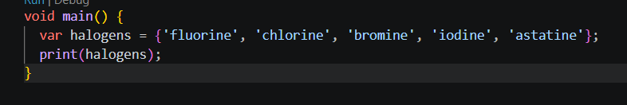
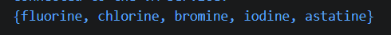
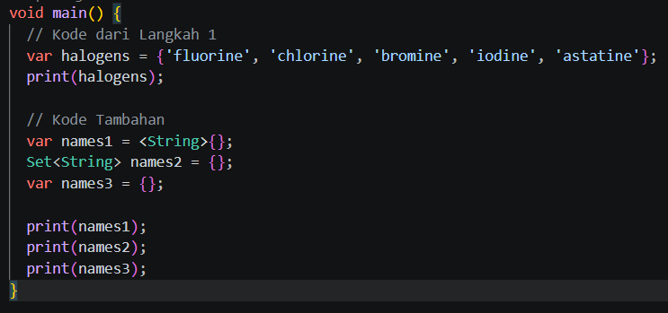
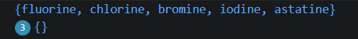
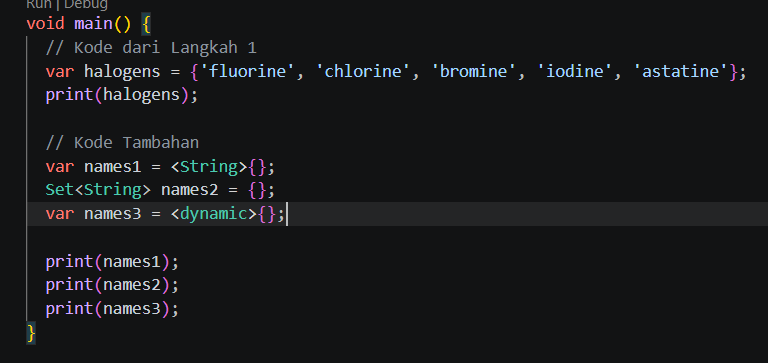

# Laporan Praktikum #04 Pemrograman Dasar Dart - Bag.3

## Identitas Mahasiswa

| Atribut | Nilai                        |
| ------- | -----                        |
| Nama    | Rafif Farrelsyah Fawwazka    |
| NIM     | 244107060054                 |
| Kelas   | SIB-2D                       |

---

# Tugas Praktikum

# Nomor 1

## Praktikum 1

Langkah 1&2:

List di Dart memiliki indeks yang dimulai dari nol dan nilainya dapat diubah setelah dideklarasikan. Penggunaan assert sangat efektif untuk memastikan data tetap konsisten selama alur program berjalan, meskipun tidak akan memengaruhi output akhir jika semua kondisi bernilai benar (True)

Langkah 3:

- final list: Menggunakan keyword final berarti variabel list tidak dapat dideklarasikan ulang (di-assign) ke objek list yang baru, namun isi di dalamnya masih bisa diubah.
- List.filled(6, null): Untuk memiliki index ke-5, list harus memiliki total 6 elemen (karena indeks dimulai dari 0). Kita mengisi nilai awal dengan null.
- <dynamic>: Digunakan agar list dapat menampung tipe data yang berbeda (String untuk nama dan null untuk default).
- Pengisian Data: Menggunakan list[1] untuk menyimpan Nama dan list[2] untuk menyimpan NIM 

## Praktikum 2

Langkah 1&2:

- Tipe Data Set: Penggunaan kurung kurawal {} pada variabel halogens menandakan bahwa ini adalah sebuah Set. Dalam Dart, Set<String> adalah kumpulan item unik yang tidak terurut.
- Inference Tipe: Karena menggunakan kata kunci var, Dart secara otomatis mendeteksi bahwa halogens adalah Set<String>.
- Fungsi print(): Baris kedua akan mencetak seluruh isi dari set tersebut dalam format standar objek Set.

Langkah 3:

tidak erorr, namun pada names 3 meskipun menggunakan kurung kurawal {}, Dart secara default menganggap {} tanpa isi dan tanpa deklarasi tipe sebagai Map kosong, bukan Set. Konsol tetap mencetak {}, tapi tipenya adalah Map<dynamic, dynamic>. Dan ini adalah perbaikannya:

- {} tanpa keterangan = Map (Kumpulan pasangan key:value).
- <String>{} atau Set{} = Set (Kumpulan nilai unik).

