# Laporan Praktikum 

## Identitas Mahasiswa

| Atribut | Nilai                        |
| ------- | -----                        |
| Nama    | Rafif Farrelsyah Fawwazka    |
| NIM     | 244107060054                 |
| Kelas   | SIB-2D                       |

---

# Tugas Praktikum

# Nomor 1

## Praktikum 1

### Langkah 1:

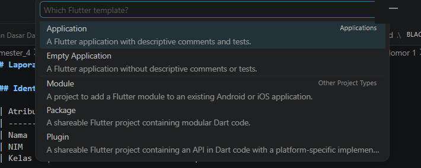

### Langkah 2:

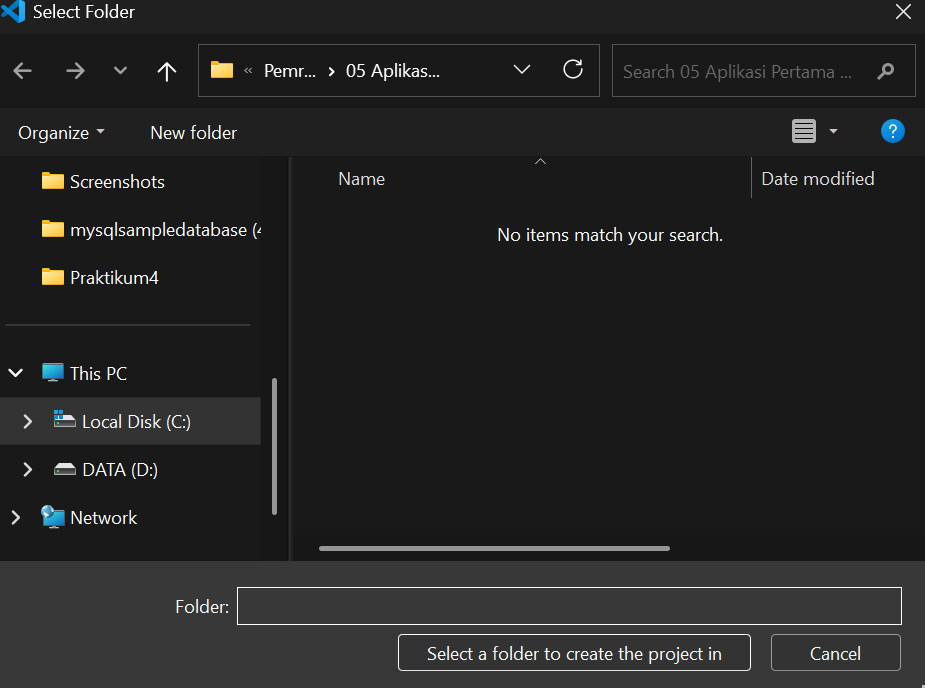

### Langkah 3:

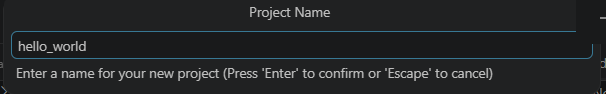

### Langkah 4:

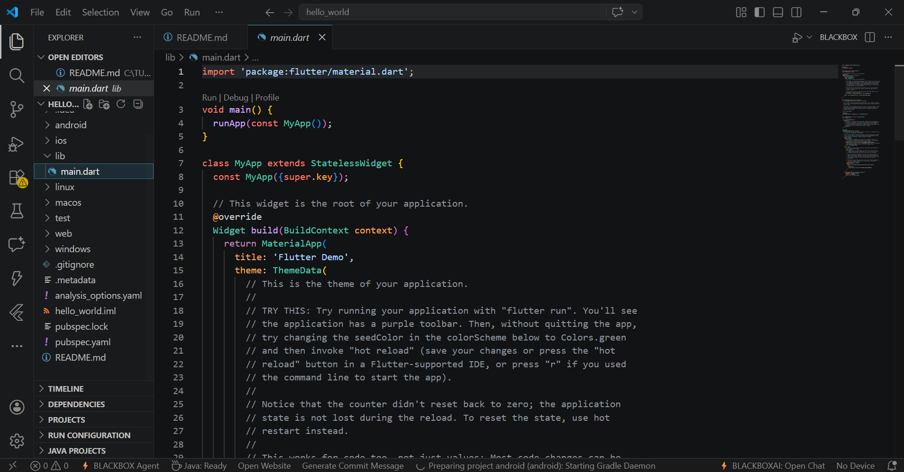

## Praktikum 2

Aktifkan Opsi Developer di HP:

izinkan debug:

flutter run:
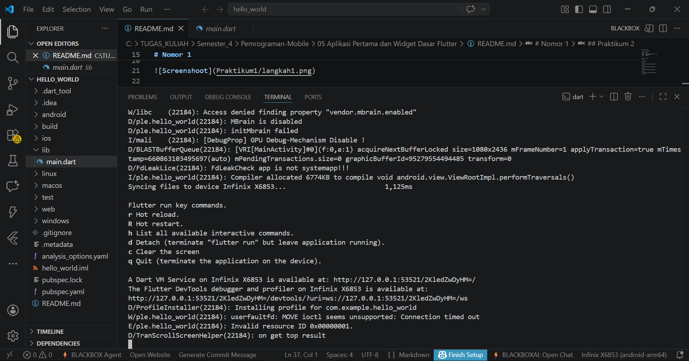

Hasil:
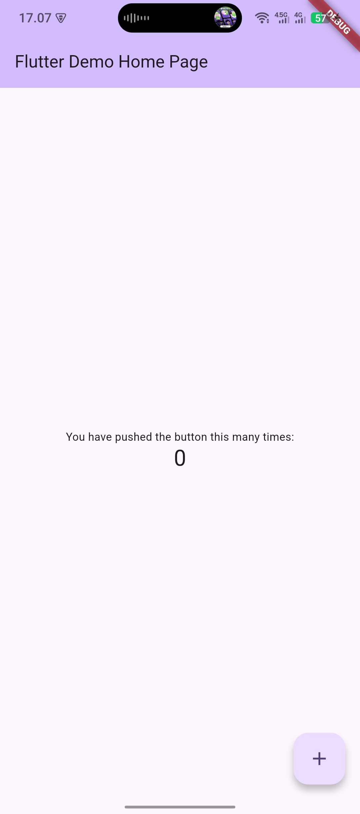

## Praktikum 3

run main.dart:
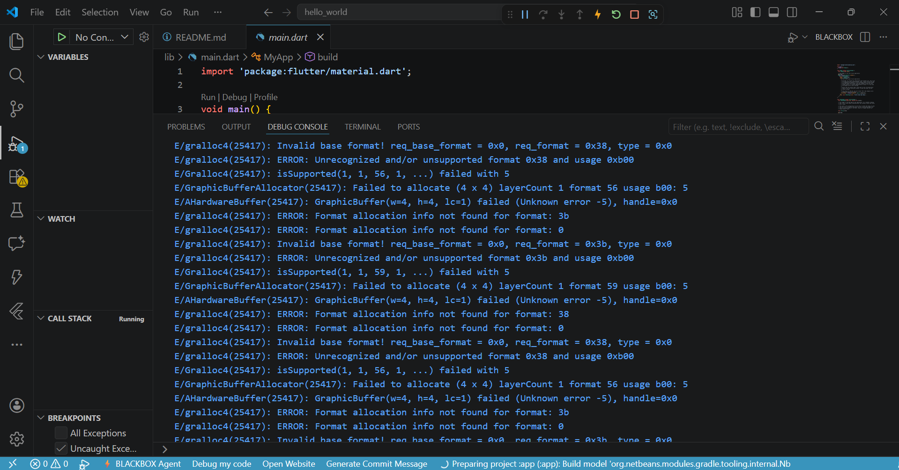

hasil:

## Praktikum 4

### langkah 1 text_widget:
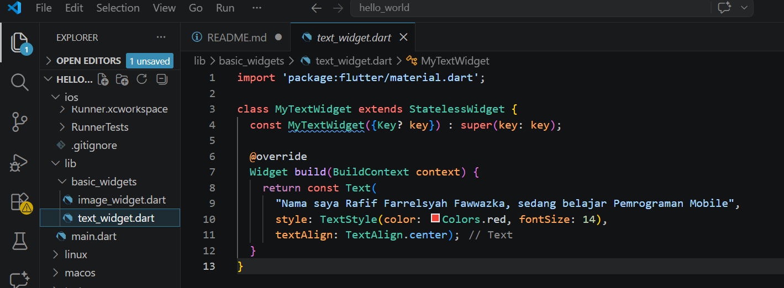

edit main.dart:
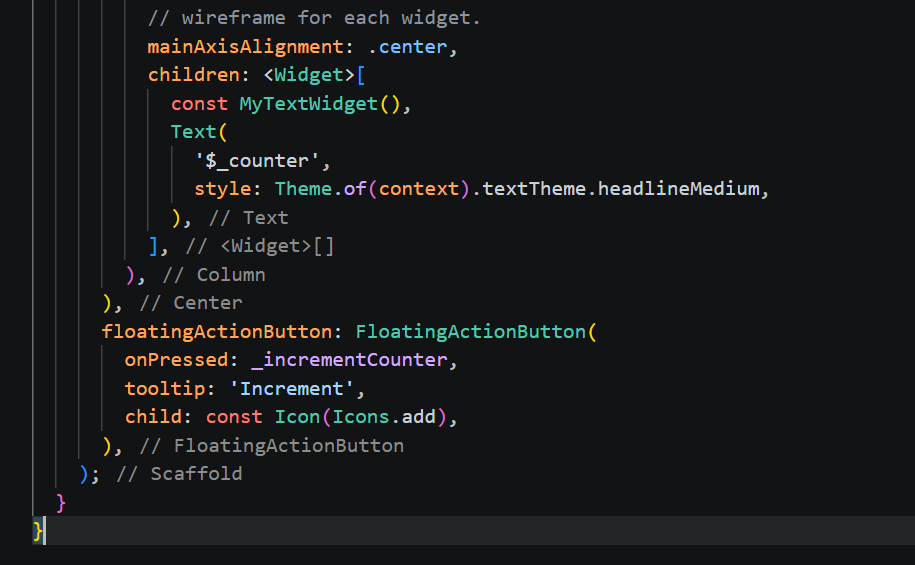

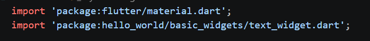

hasil run:
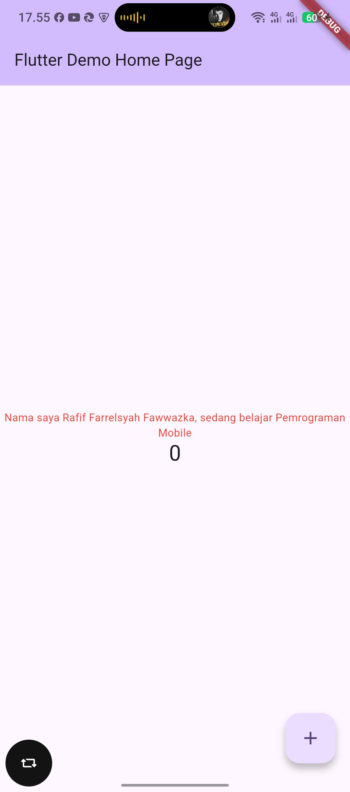

### langkah 2 image_widget:
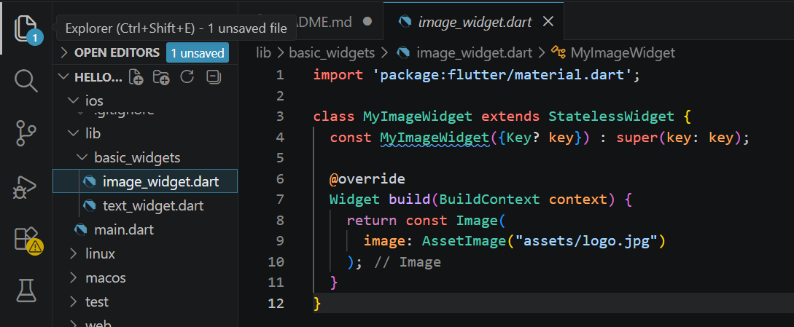

edit main.dart:

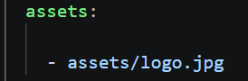

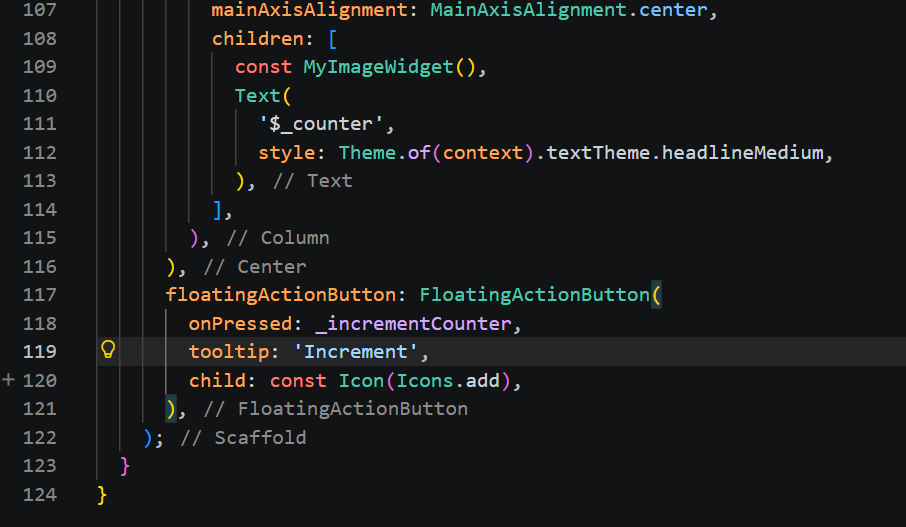

hasil run:
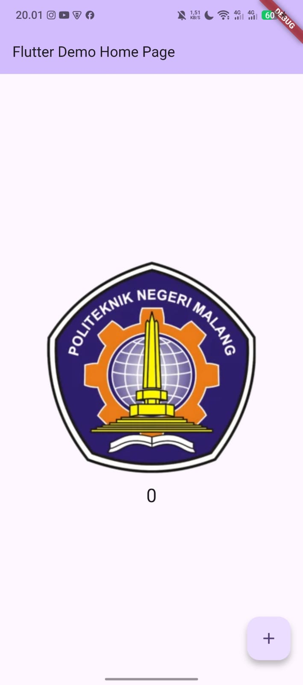

## Praktikum 5

### langkah 1: loading_cupertino.dart:

edit main:
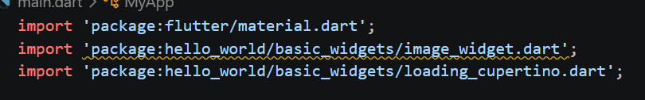

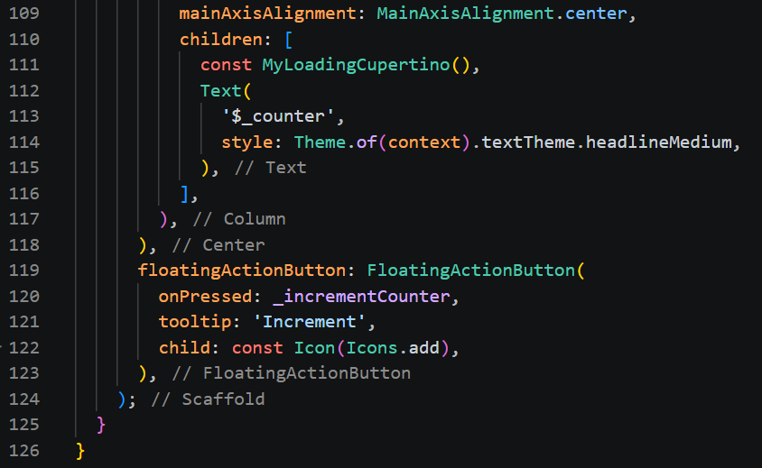

hasil:

### langkah 2: fab_widget.dart:

edit main:
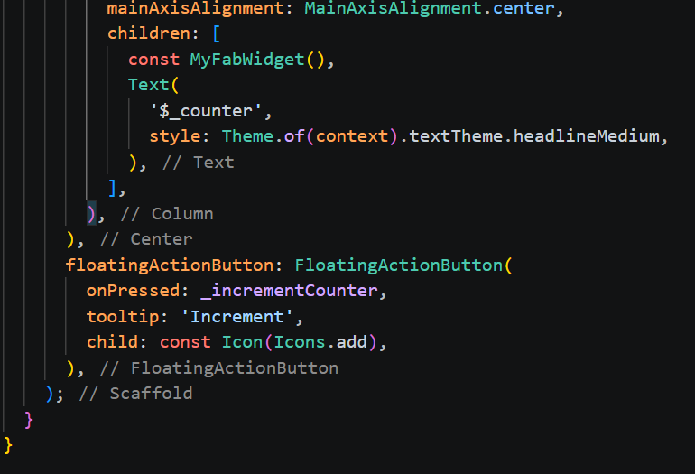

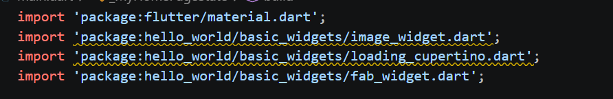

hasil:

### langkah 3: scaffold widget
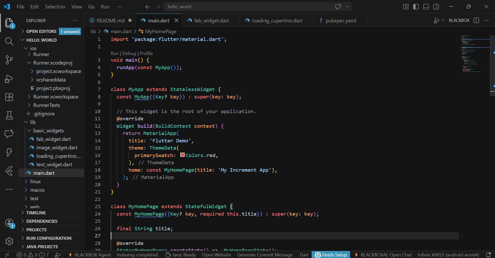

hasil:

### langkah 4: Dialog Widget
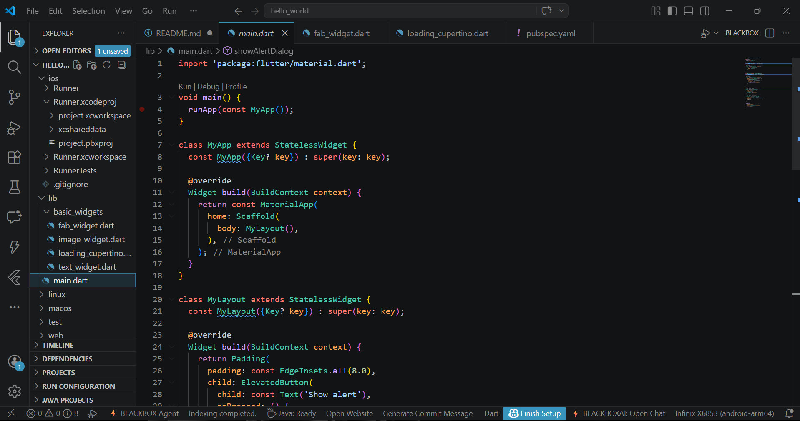

hasil:

### Langkah 5: Input dan Selection Widget
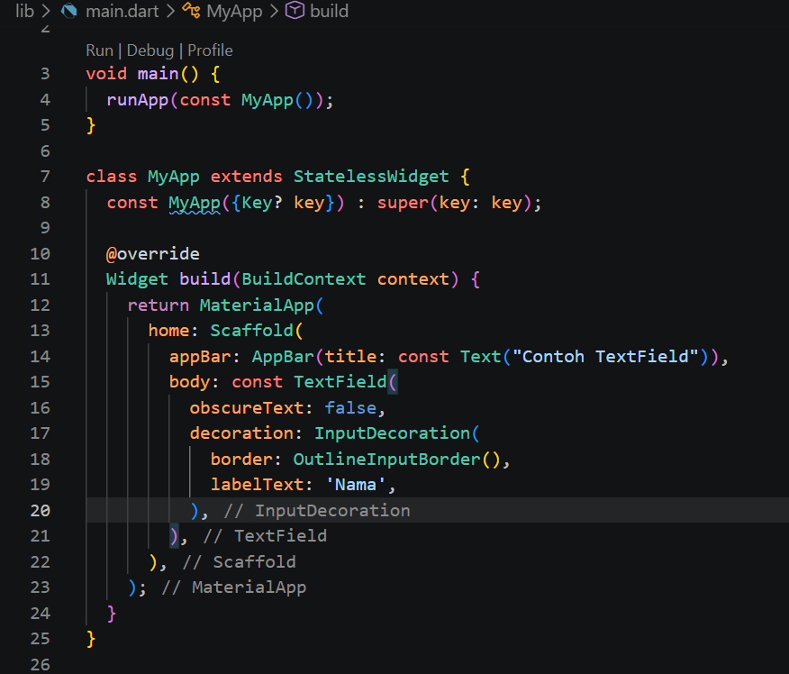

hasil:

### Langkah 6: Date and Time Pickers
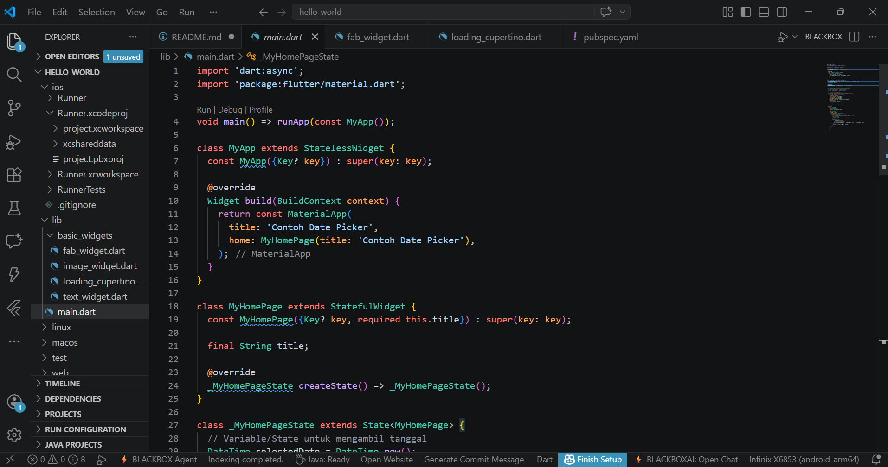

hasil:

# Nomor 2

