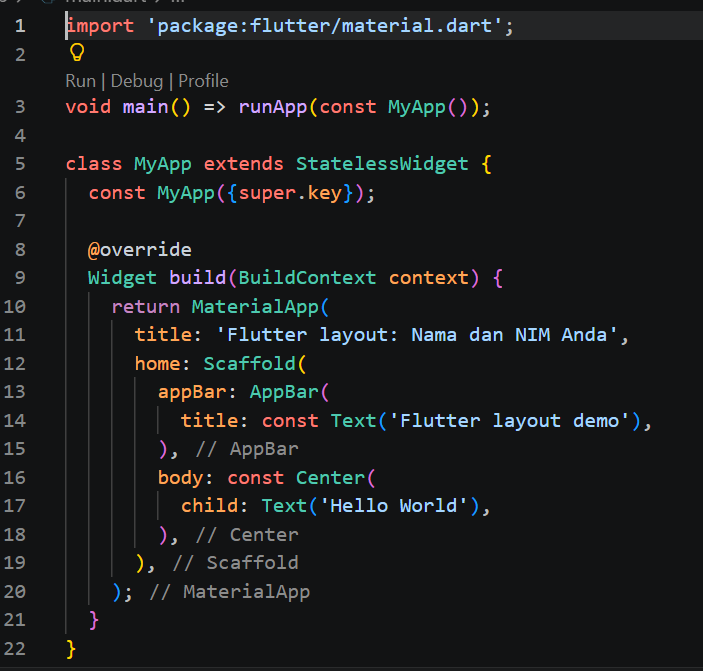
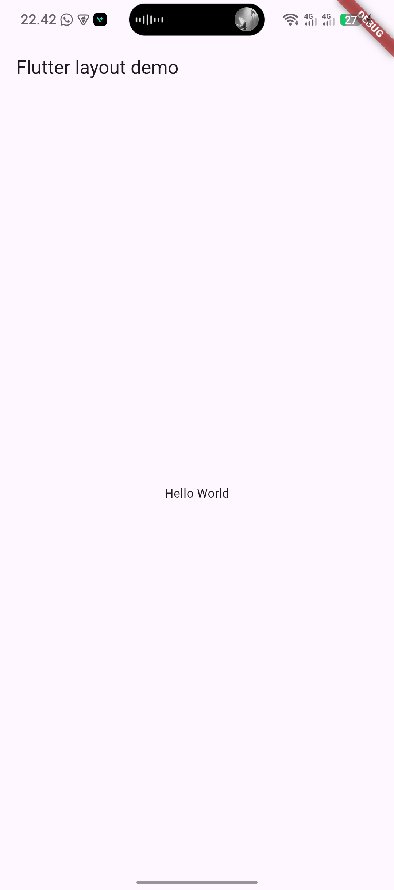
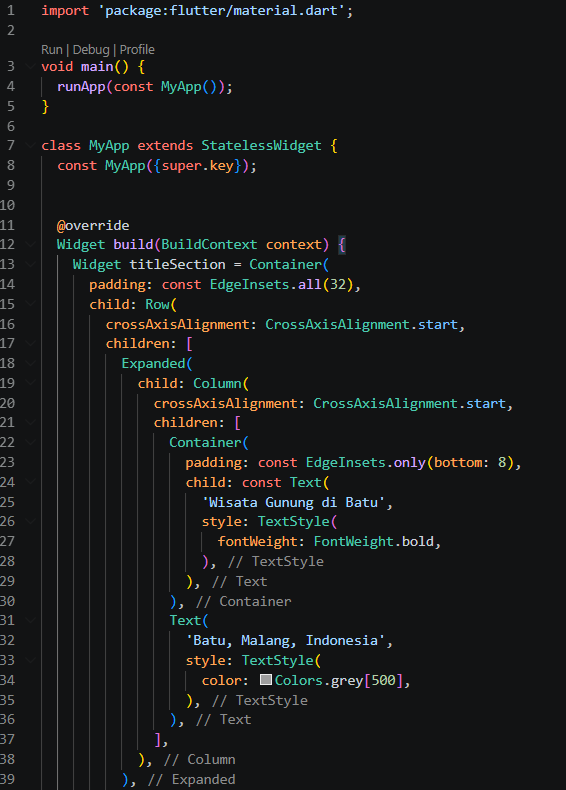
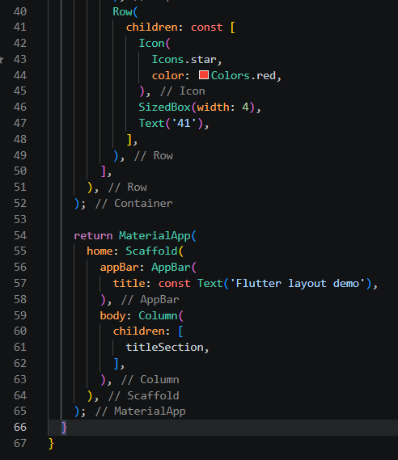
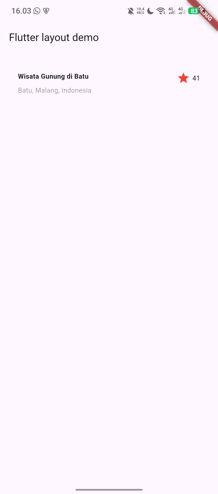
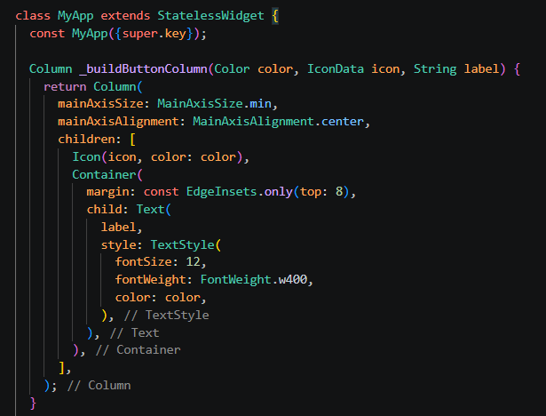
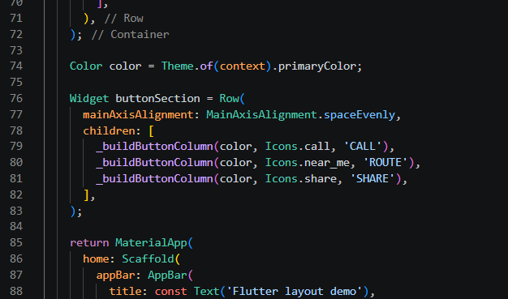
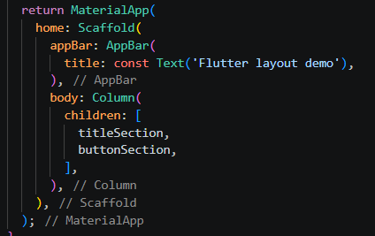

# Laporan Praktikum #02 Langout dan Navigasi

## Identitas Mahasiswa

| Atribut | Nilai                        |
| ------- | -----                        |
| Nama    | Rafif Farrelsyah Fawwazka    |
| NIM     | 244107060054                 |
| Kelas   | SIB-2D                       |

---

# Nomor 1

## Praktikum 1

Langkah 1 Buat Project Baru:

Langkah 2 Buka file lib/main.dart:

Langkah 3: Identifikasi layout diagram

Langkah 4: Implementasi title row

## Praktikum 2

Langkah 1: Buat method Column _buildButtonColumn

Langkah 2: Buat widget buttonSection

Langkah 3: Tambah button section ke body

Hasil Run:

## Praktikum 3

